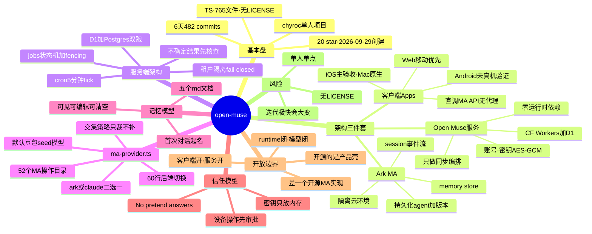

# open-muse 调研

- 对象：[chyroc/open-muse](https://github.com/chyroc/open-muse)（已 fork 到 [ringozzt/open-muse](https://github.com/ringozzt/open-muse)）
- 一句话：开源的个人 AI agent 客户端（iOS / Mac / Web / Android），跑在"托管 Agent"（Managed Agents，简称 MA）服务上；App 不设模型代理，拿用户自己的 key 直接调 MA API。
- 基本盘（2026-10-05 实测）：20 star / 2 fork / 0 release / 0 issue；2026-09-29 创建；**单人 482 commits**（chyroc 一人）；TypeScript，765 个文件；默认分支 master；**无 LICENSE 文件**。
- 调研日期：2026-10-05（当日 23:45 修订：聚焦项目自身现状）

## 1. 它是什么

一个客户端应用：iPhone 上聊天、读 Apple Health、收提醒；Mac 上经审批做 computer use（看屏幕、点按、输入）；Web 端移动优先；Android 代码在仓库里但"尚未在真机上验证"。核心特征是**没有自己的模型代理**——App 拿着用户自己的 key 直接调 MA API。

MA 是什么：托管的 agent loop，四个一等资源——**持久化的 agent（含版本）、隔离的云环境、带事件流的 session、记忆库（memory store）**。session 里可挂文件和 Vault，tools / MCP / skills / 多 agent 配置由上游执行。

## 2. 架构三件套

```
┌──────────────┐   ┌──────────────────┐   ┌───────────────────┐
│  客户端 Apps  │   │ Open Muse 服务   │   │  Volcano Ark MA   │
│ iOS/Mac/Web/ │──▶│ 账号·密钥·调度   │──▶│ 真正的 agent loop │
│ Android      │   │ (CF Workers+D1)  │   │ 沙箱·记忆·session │
└──────────────┘   └──────────────────┘   └───────────────────┘
      │                      │                        │
  直接调 MA API          只做同步编排              执行一切
  (用户自己的 key)       不替 MA 跑 loop
```

- **客户端**（`src/` 193 文件）：直接调 MA 数据平面。无 MA 连接时保持登出——"网络故障永远不产生模拟回复"。
- **Open Muse 服务**（`server/`，Cloudflare Workers + D1）：管账号、密钥（AES-GCM 加密，只读回内存不落盘）、定时 Feed / 目标 check-in / 提醒投递。设计文档明说：服务只做同步编排，"不替 Ark 跑 loop"。
- **Ark MA**：agent、环境、session、记忆库全在它那儿。

## 3. 服务端架构

`server/` 共 28 个源文件，技术栈克制：Cloudflare Workers 单文件路由（`index.ts` 约 700 行，30 来个路由），D1 生产 + Postgres 自托管（两套 migration 目录，测试双跑），Supabase 只做 Auth，cron 每 5 分钟 tick 一次。`package.json` 里**零运行时依赖**——全是 devDependencies，Workers + D1 + Web 标准 API 打全场。

核心是 `jobs.ts` 的后台任务机，一个手写的状态机：queued → creating → ready → sending → running → complete / failed / needs_attention，带 lease fencing。每次 tick 用一条 SQL 选出 20 个到期租户（bounded、oldest-due-first），一个租户出错不影响其他租户，key 绝不跨租户复用，fail closed。贯穿始终的军规：**不确定的结果先去上游只读核查，绝不盲重试**。

其他模块：`connection.ts`（密钥密封存储，revision 围栏）、`sync.ts`（设备同步：outbox + mutation ID，stale 写返回 server copy）、`upcoming.ts`（提醒投递）、`claims.ts`（多设备防重复投递）、`lark*.ts`（飞书连接）、`webhooks.ts`（外部 webhook 入站，secret 认证）、`browser.ts`（云浏览器中继）、`rotation.ts`（密钥轮换的 bounded batch reseal）、`account-deletion.ts` / `account-export.ts`（删除与导出）。

"后台持续工作"在这里的实现是**无状态 Workers + cron tick**，任务粒度 5 分钟；`BACKGROUND_ENABLED` 默认 false，后台能力默认关闭。

## 4. ma-provider.ts：60 行的后端切换

整个后端抽象就一个文件（`shared/ma-provider.ts`，约 60 行）：

- `MAProviderId = "ark" | "claude"`，构建时二选一。
- 默认 Ark：`ark.cn-beijing.volces.com`，新 agent 默认模型 `doubao-seed-2-1-pro-260915`。
- 备选 Claude MA：Anthropic API，模型 `claude-opus-5-5`，甚至带 `anthropic-dangerous-direct-browser-access` 头——从 WebView 直调 API。
- 关键设计决策：**capability intersection，不模拟只裁剪**——Ark 有而 Claude 没有的能力，Claude 后端直接砍掉，不做模拟补齐。

MA 操作目录：`shared/ma-contract.json` + `shared/ma.ts` 注册了 **52 个操作**（agent 6、environment 5、session 11、memory 12、连接与凭证 13、skills 2、文件 3）。文档明确："Integrated"只表示适配代码和入口存在，不等于真实账号验收过。

## 5. 记忆模型

个人记忆就是 MA 记忆库里的几个 Markdown 文件：`GOALS.md`、`SOUL.md`、`MEMORY.md`、`IDENTITY.md`、`FEED.md`，用户可在 App 里打开、编辑、清空。首次对话时 MA 给出起名选项（Kit / Milo / Muse），选定后写进 `IDENTITY.md`；之后的目标、提醒、Feed 指令都以这些文档为源。

## 6. 信任模型：Built to be trusted

- 用 Mac / 读健康数据前先审批；Calendar 和定位每次都问。
- "No pretend answers"：连不上就直说，绝不编一个假回复；结果不确定的写操作先核查不盲重试。
- 密钥只放内存不落设备存储；记忆文档用户可见、可编辑、可清空。

## 7. 开放边界：开的是哪几层

把栈拆开四层，看每一层的开放程度：

| 层 | 状态 |
|---|---|
| 客户端（iOS/Mac/Web/Android） | 开源，全在仓库里 |
| 编排服务（账号/密钥/调度/同步） | 开源，全在 `server/` |
| Agent runtime（loop、工具执行、沙箱、session） | **闭源**：火山 Ark MA / Anthropic MA，都是专有云服务 |
| 模型 | 闭源 |

结论：**开源的是"产品壳"，闭源的是"干活的 runtime"**——相当于开源了一个客户端，runtime 还在云厂商手里。`self_hosted` 配置项存在，但文档承认"App 自身不提供对应的 runtime worker"，即没有开源的 MA 实现。

唯一的后门是 `ma-contract.json`：它把 runtime 接口文档化了（52 个操作），形成了一个可移植的边界——只要有人按这 52 个操作实现一个开源 MA，就能把整个栈补成全开源。目前还没有。

## 8. 验证状态与风险

- 2026-09-30 的验证记录：452 个测试通过（含 89 个直连客户端用例），区分了 mock 回归和真实云测试；验收重点是 iOS。
- Android 未在真机验证；Claude 后端未端到端验证；check-in 和提醒的真实 MA 调度尚未演练。
- **无 LICENSE 文件**：借代码、改代码前先确认授权。
- 单人项目，6 天 482 commits：迭代极快，API 和行为都可能大变；single point of failure 是作者本人。

## 思维导图



交互版导图：[mindmap.html](./mindmap.html)

## 延伸构想

- [True Open-Muse 构想](./true-open-muse.md)：用 dsh + oar 补上闭源的 MA runtime，拼全开源、厂商无关的个人 Agent 栈。
