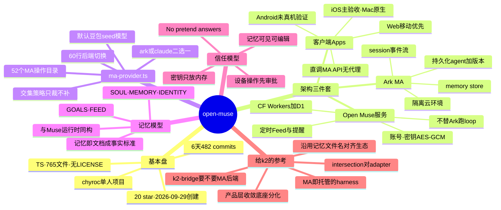

# open-muse 调研：个人 Agent 的开源孪生兄弟

- 对象：[chyroc/open-muse](https://github.com/chyroc/open-muse)（已 fork 到 [ringozzt/open-muse](https://github.com/ringozzt/open-muse)）
- 一句话：开源的个人 AI agent 客户端（iOS / Mac / Web / Android），跑在"托管 Agent"（Managed Agents）服务上——**和你现在用的 Muse 是同一个产品形状**。
- 基本盘（2026-10-05 实测）：20 star / 2 fork / 0 release / 0 issue；2026-09-29 创建，6 天；**单人 482 commits**（chyroc 一人，约 80 commits/天）；TypeScript，765 个文件；默认分支 master；**无 LICENSE 文件**。
- 调研日期：2026-10-05

## 1. 它是什么

一个客户端应用：iPhone 上聊天、读 Apple Health、收提醒；Mac 上经审批做 computer use；Web 端移动优先；Android 在仓库里但"尚未在真机上验证"。核心特征是**没有自己的模型代理**——App 拿着用户自己的 key 直接调 Managed Agents（MA）API。

MA 是什么：托管的 agent loop，四个一等资源——**持久化的 agent（含版本）、隔离的云环境、带事件流的 session、记忆库（memory store）**。session 里挂文件和 Vault，tools / MCP / skills / 多 agent 配置由上游执行。

## 2. 架构三件套

```
┌──────────────┐   ┌──────────────────┐   ┌───────────────────┐
│  客户端 Apps  │   │ Open Muse 服务   │   │  Volcano Ark MA   │
│ iOS/Mac/Web/ │──▶│ 账号·密钥·调度   │──▶│ 真正的 agent loop │
│ Android      │   │ (CF Workers+D1)  │   │ 沙箱·记忆·session │
└──────────────┘   └──────────────────┘   └───────────────────┘
      │                      │                        │
  直接调 MA API          只做同步编排              执行一切
  (用户自己的 key)       不替 Ark 跑 loop
```

- **客户端**（`src/` 193 文件）：直接调 MA 数据平面。无 MA 连接时保持登出——"网络故障永远不产生模拟回复"。
- **Open Muse 服务**（`server/`，Cloudflare Workers + D1/Postgres）：管账号、密钥（AES-GCM 加密，只读回内存不落盘）、定时 Feed / 目标 check-in / 提醒投递。设计文档明说：服务只做同步编排，"不替 Ark 跑 loop"。
- **Ark MA**：agent、环境、session、记忆库全在它那儿。

## 3. ma-provider.ts：60 行的后端切换

整个后端抽象就一个文件（`shared/ma-provider.ts`，约 60 行）：

- `MAProviderId = "ark" | "claude"`，构建时 `VITE_MUSE_MA_PROVIDER` 二选一。
- 默认 Ark：`ark.cn-beijing.volces.com`，新 agent 默认模型 `doubao-seed-2-1-pro-260915`（豆包）。
- 备选 Claude MA：Anthropic API，模型 `claude-opus-5-5`，甚至带 `anthropic-dangerous-direct-browser-access` 头——**从 WebView 直调 API**。
- 关键设计决策：**capability intersection，不模拟只裁剪**——Ark 有而 Claude 没有的能力，Claude 后端直接砍掉，"leaves it out instead of emulating it"。

这是 oar 的"library 不做 protocol"那套哲学在客户端的镜像：oar 用 library 抹平 harness 差异，open-muse 用 60 行接口抹平 MA 后端差异——但策略相反，oar 做 adapter 补齐，open-muse 做**交集**，缺的就不要。

MA 操作目录：`shared/ma-contract.json` + `shared/ma.ts` 注册了 **52 个操作**（agent 6、environment 5、session 11、memory 12、连接与凭证 13、skills 2、文件 3）。"Integrated"只表示适配代码和入口存在，不等于真实账号验收过。

## 4. 记忆模型：和 Muse 同构

个人记忆就是 MA 记忆库里的几个 Markdown 文件：`GOALS.md`、`SOUL.md`、`MEMORY.md`、`IDENTITY.md`、`FEED.md`——和你现在用的 Muse 的运行时文件**同名同构**。首次对话时 MA 给出起名选项（Kit / Milo / Muse），选定后写进 `IDENTITY.md`。

这说明这套"记忆即文档"的约定正在成为个人 agent 的**事实标准**，不止一家在用。

## 5. 信任模型：Built to be trusted

- 用 Mac / 读健康数据前先审批；Calendar 和定位每次都问。
- "No pretend answers"：连不上就直说，绝不编一个假回复；结果不确定的写操作先核查不盲重试。
- 密钥只放内存不落设备存储；记忆文档用户可打开、可编辑、可清空。

和 Muse 的审批卡片是同一套伦理，只是实现位置不同（Muse 在运行时网关，open-muse 在客户端）。

## 6. 验证状态（诚实但单薄）

- 2026-09-30 的验证记录：452 个测试通过（含 89 个直连客户端用例），区分了 mock 回归和真实云测试。
- 验收重点是 iOS；Web/Mac 是"早期直连验证"，Android 未在真机验证；Claude 后端"未端到端验证"。
- 客户端**没有**定时任务、推送、HealthKit、支付——调度全靠 Open Muse 服务。

## 7. 给 Te 的 5 条参考

1. **同一个产品，两种 substrate**：Muse 的云底座是 Meta 自建的 systemd-nspawn + Cloud Hypervisor VM（你在 muse-cloud-arch 里亲手验证过）；open-muse 的底座是火山 Ark 的 MA 托管服务。产品形状收敛了，底座还在分化——"个人 agent"是产品层概念，"loop 跑在哪"是 infra 层概念，两层正在解耦。
2. **MA 就是"托管的 harness"**：persisted agent + isolated env + session + memory store，这正是 dsh/oar 在本地想拼出来的东西，只是 Ark 把它做成了云服务。k2 的 daemon 是自建 loop，MA 是租用 loop——k2-bridge 未来要不要出一个"MA 后端"，和 Codex/Claude/ACP 并列？
3. **intersection vs adapter**：open-muse 遇到后端能力差直接砍（交集），oar 遇到 harness 差异写 adapter（并集）。k2-bridge 走的是 adapter 路线——代价是每个后端都要补齐，好处是用户无感。两条路都成立，选哪条取决于"你更怕缺功能还是更怕维护 adapter"。
4. **记忆即文档正在成为事实标准**：SOUL/MEMORY/IDENTITY 这套命名两家撞车不是巧合。k2 如果要做长期记忆，直接沿用这套文件名就是和生态对齐。
5. **单人 6 天 482 commits**：这就是 AI 写代码的产能样本——一个人 + agent，6 天干出 765 个文件的四端客户端。churn 率必然高，但"先堆出来再收敛"本身就是 AI 原生开发的新常态。**注意**：仓库无 LICENSE 文件，借代码前先确认授权。

## 思维导图



交互版导图：[mindmap.html](./mindmap.html)
